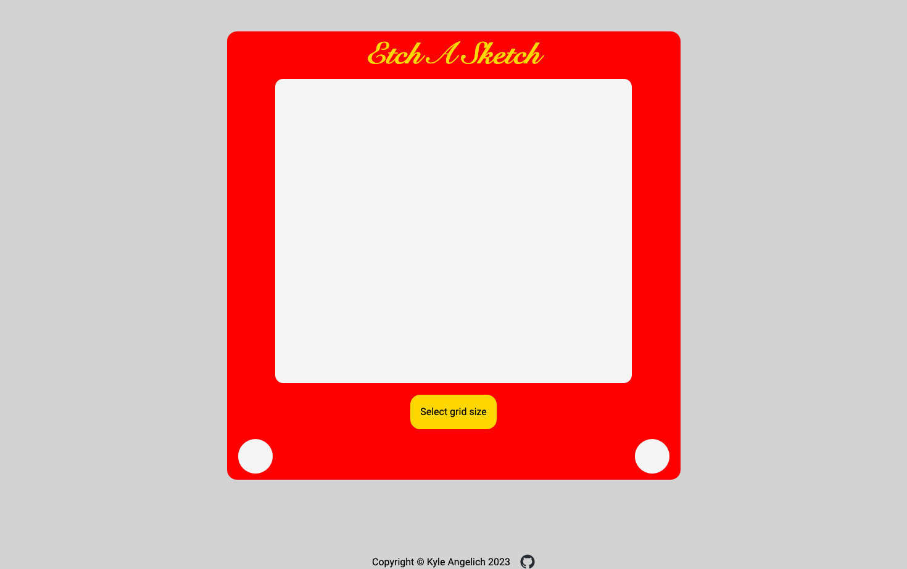

# odin-etch-a-sketch

This project was completed as part of The Odin Project, however, I decided to add additional features to personalize my project and to gain more experience.

## Overview

### The challenge

Users should be able to:

- Select a grid size that is less than 100x100
- Draw/doodle inside of the Etch A Sketch screen
- Create increasingly darker grid tiles depending on how many times their mouse enters a tile

### Screenshot

### Links

- Live Site URL: [Etch A Sketch - live link](https://kylea99.github.io/odin-etch-a-sketch/)

### Built with

- Semantic HTML5 markup
- CSS custom properties
- Flexbox
- CSS Grid
- Vanilla JavaScript
- JavaScript DOM